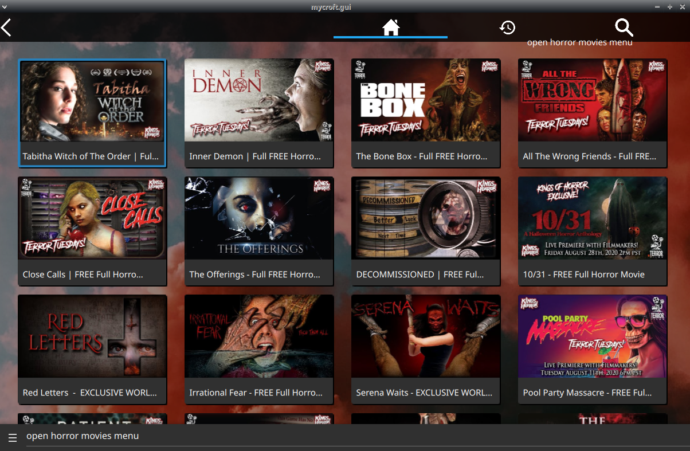

# Kings of Horror Skill

## About 

Indie horror movies for Mycroft

## Installation Notes

this requires latest CPS refactor, not yet merged in core

- [skill-playback-control@cps_refactor_testing](https://github.com/JarbasAl/skill-playback-control/tree/cps_refactor_testing)
- [CPS_extend_timeout](https://github.com/MycroftAI/mycroft-core/pull/2666)
- [exact voc_match](https://github.com/MycroftAI/mycroft-core/pull/2675)
- [CPSMatchType](https://github.com/MycroftAI/mycroft-core/pull/2660)
- [self.gui.play_video](https://github.com/MycroftAI/mycroft-core/pull/2683)

## Examples 

* "open horror movies menu"
* "play ninja zombies movie"
* "play horror movie"

## Credits 
- JarbasAl
- [AIIX ](https://github.com/AIIX/) - GUI
- [Kings of Horror](https://www.youtube.com/user/TheKingsofHorror/)

## Category
**Entertainment**

## Tags
#movies
#horror
#indie
#video
#entertainment